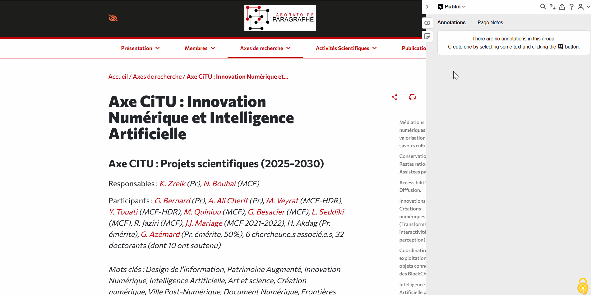

 

[Hypothes.is](https://web.hypothes.is/) est une application web open source ayant pour objectif principal d’enrichir la lecture en ligne via des annotations collaboratives. En effet, l'application offre aux utilisateurs la possibilité de surligner ou d'annoter des pages web ou des documents PDF comme dans un livre, puis d'y lancer des discussions entre utilisateurs à partir même de ces annotations. Ces annotations peuvent être consultées par les utilisateurs du monde entier, via un canal _Public_ par défaut, ou par un nombre de collaborateurs plus restreint, via la création simple et rapide de groupes collaboratifs privés.

L’application [Hypothes.is](https://web.hypothes.is/) s'ancre par ailleurs pleinement dans les enjeux académiques des Humanités Numériques en soutenant des pratiques de science ouverte, en favorisant la transparence des processus intellectuels et en offrant un support pour l’écriture critique collective. Intégrée aux environnements de recherche en ligne, Hypothes.is permet ainsi d’ancrer la lecture dans un dialogue actif, rigoureux et collaboratif — au service de la production et de la circulation du savoir.

# Prise en main d'Hypothes.is

Les points ci-dessous vous guideront dans le processus d'installation de *Hypothes.is* jusqu'à l'intégration du groupe privé Hypothes.is. Mais **avant tout chose**, pensez bien à vous [créer un compte](https://hypothes.is/signup). 

## Configurer l'interface sur votre navigateur

Aujourd'hui, la méthode pour installer *Hypothes.is* varie en fonction du navigateur que vous utilisez quotidiennement. Le premier cas, concernant les utilisateurs de navigateurs type **Google Chrome, Microsoft Edge, Opéra** ou tout autre navigateur basé sur [Chromium](https://fr.wikipedia.org/wiki/Chromium), il suffit simplement d'ajouter l'[extension officielle](https://chromewebstore.google.com/detail/hypothesis-web-pdf-annota/bjfhmglciegochdpefhhlphglcehbmek). Pour les autres navigateurs comme **Firefox ou Safari**, la méthode est différente puisqu'il faut passer par ce que l'on appelle un [Bookmarklet](https://fr.wikipedia.org/wiki/Bookmarklet).

Une fois l’extension ou le Bookmarklet mis en place sur votre navigateur, rendez-vous sur la page à annoter puis activez *Hypothes.is* en cliquant sur l'icone de l'extension ou sur le marque-page. Ensuite, connectez-vous en cliquant sur "log-in" et voilà, *Hypothes.is* est prêt à être utilisé !

::: {.callout-note}

À noter que, pour Firefox, il existe une [extension non-officielle](https://addons.mozilla.org/fr/firefox/addon/unofficial-hypothesis/) répliqnant l'expérience de la version officielle pour Chromium. ***Cependant, celle-ci ne permet pas d'annoter les PDF téléchargés localement***.

:::

### Mettre en place le Bookmarklet

Comme mentionné précédemment, les navigateurs hors-Chromium ne possèdent pas officiellement d'extension. La solution officielle proposée par *Hypothes.is* est **de mettre en place un Bookmarklet**, c'est-à-dire une injection *JavaScript* dans la page. Cette section va montrer vous présenter comment mettre en place, facilement, ce Bookmarklet. 

**Description du GIF étape par étape** :

**Étape n°1** : Rendez vous sur le site d'*Hypothes.is* dédié à son Bookmarklet ([Cliquez ici](https://web.hypothes.is/help/installing-the-bookmarklet/)), puis scrollez jusqu'à "*For most browsers (except mobile devices)*".

- - -

**Étape n°2** : Repérez le bouton "*Hypothes.is Bookmarklet*", attrapez le en maintenant clic gauche puis glissez-le jusqu'à vos marques-pages. 

- - -

**Étape n°3** : Rendez vous sur la page à annoter puis cliquez sur le marque-page pour ouvrir l'interface Hypothes.is. Voilà, *Hypothes.is* est prêt à être utilisé !

## Commencer à annoter

Une fois connecté à *Hypothes.is*, l'interface ouverte et le groupe rejoint, il est temps de commencer à annoter ! 

**Description du GIF étape par étape** :

**Étape n°1** : D'abord, assurez-vous que *Hypothes.is* est bien lancé en vérifiant si le menu à droite de l'écran peut s'ouvrir. Si ce n'est le cas, cliquez sur l'icone de l'extension ou du Bookmarklet pour la démarrer.

- - -

**Étape n°2** : Sélectionnez la partie du document à annoter en le surlignant. Une fois le surlignage effectué, une bulle va apparaître avec les options "Highlight" et "Annotate" : Le premier permet d'uniquement surligner tandis que le second **permet d'annoter l'élément** en plus de le surligner. La deuxième option est donc à privilégier pour ajouter du détail.

- - -

**Étape n°3** : Une fois "annotate" sélectionné, l'interface s'ouvre. Remplissez la zone de texte avec vos idées, ajoutez des mots clefs dans la zone en dessous dédiée aux "tags". Enfin, cliquez sur "Post to *groupname*" (vérifiez bien d'être dans le bon [groupe](#accéder-à-un-groupe-dannotation-collectif)). 

- - -

**Étape n°4** : La note est maintenant publiée ! Les autres usagers sur le groupe peuvent maintenant lire et interagir avec votre annotation.

## Interagir avec une annotation existante

Peut-être que, pendant votre lecture, vous trouverez d'autres annotations laissées par d'autres utilisateurs. Et pourquoi ne pas interagir avec ?

**Description du GIF étape par étape** : 

**Étape n°1** : D'abord, assurez-vous que *Hypothes.is* est bien lancé en vérifiant si le menu à droite de l'écran peut s'ouvrir. Si ce n'est le cas, cliquez sur l'icone de l'extension ou du Bookmarklet pour la démarrer. 

- - -

**Étape n°2** : Les annotations déjà publiées sont visibles à travers le texte surligné jaune. Cliquez sur l'annotation sur laquelle vous voulez interagir pour ouvrir l'interface, avec l'annotation.

- - -

**Étape n°3** : En bas à droite de l'annotation, cliquez sur l'icone de flèche "**Reply**" pour faire apparaître une boite de texte.

- - -

**Étape n°4** : Ajoutez votre texte, vos tags, puis cliquez sur "Post to *groupname*". Votre réponse est maintenant publiée, et une conversation entamée !

## Accéder à un groupe d'annotation collectif

Comme évoqué en introduction, Hypothes.is mets à disposition deux moyens de diffusion pour les annotations :

- Le canal **Public** : Celui par défaut, où les utilisateurs du monde entier peuvent ajouter des annotations, consulter et interagir avec celles-ci.  
- Les **groupes privés** : À créer manuellement, pour permettent une diffusion plus restreinte des annotations.

### Créer et partager son propre groupe d'annotation privé
N'importe quel utilisateur de *Hypothes.is* peut créer ses propres groupes privés d'annotation. 

**Étape n°1** : D'abord, assurez-vous que *Hypothes.is* est bien lancé en vérifiant si le menu à droite de l'écran peut s'ouvrir. Si ce n'est le cas, cliquez sur l'icone de l'extension ou du Bookmarklet pour la démarrer.

- - -

**Étape n°2** : Ouvrez le panneau latéral de l'extension. Cliquez sur "Public", puis sur "Create new group", ce qui vous redirigera sur la [page de création de groupe](https://hypothes.is/groups/new).

- - -

**Étape n°3** : Renseignez un nom de groupe (obligatoire) et une description (optionnel) puis cliquez simplement sur "*Create group*".

- - -

**Étape n°4** : Votre groupe d'annotation est prêt ! Envoyez le lien présents dans "*Invite new members*" pour inviter d'autres utilisateurs de *Hypothes.is* dans votre groupe.  

# Pourquoi utiliser Hypothes.is ?

## Dans un contexte d'utilisation général (personnel, professionnel, ...)

Repenser notre façon de lire et d'interagir dans le numérique

Usage personnel = lecture d'articles de journaux, lecture de documentation, ... pour annoter pour vous et/ou pour les autres

Usage professionnel = avec groupe privé, peut permettre des relectures collaboratives et interactives de documents.

## Dans le contexte de la cartographie "CartoExpert "

Dans le cadre du projet CartoExpert, nous allons exploiter le concept d'annotation comme moyen collaboratif de maintenir à jour les données de CartoExpert : dès lors qu'un membre du service repère une coquille *(information à préciser, qui n'est plus d'actualité, ...)*, celui-ci pourra laisser une annotation sur l'interface qui, par la suite, pourra être consultée par les opérateurs chargés du maintien du logiciel afin d'y apporter (ou non) les modifications nécessaires.

Par cette nouvelle méthode, l'actualisation des données pourra se faire en continu en plus d'ajouter une dimension collaborative au maintien à jour des données du service. 