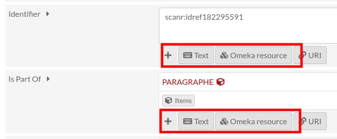
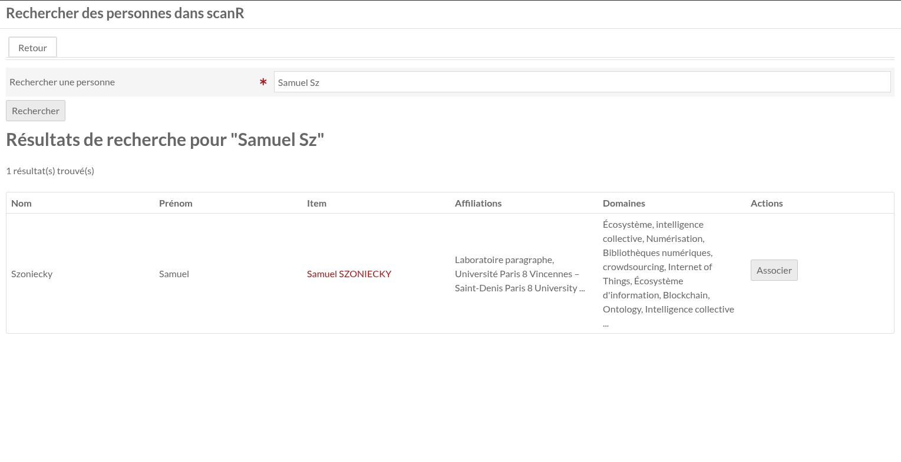
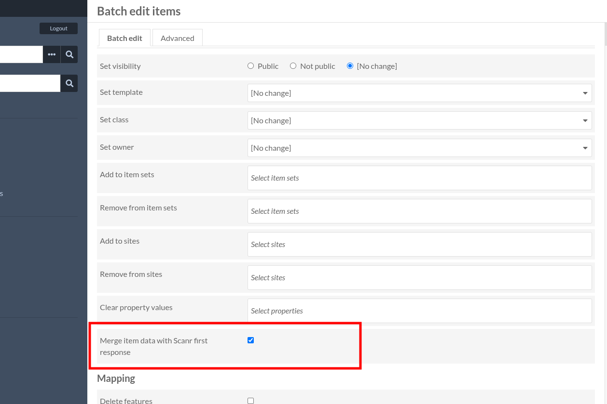

## Préambule

**Durée : ~1 heure.** À la fin de la formation, les participants seront capables de :

::: {.grid}
::: {.g-col-12 .g-col-md-4}
**1. Comprendre**

La logique interne d'Omeka S : items, item sets, relations.
:::
::: {.g-col-12 .g-col-md-4}
**2. Naviguer**

Se repérer dans la base sans confondre les types d'objets.
:::
::: {.g-col-12 .g-col-md-4}
**3. Modifier**

Effectuer des modifications ciblées directement dans l'interface.
:::
:::

::: {.callout-note appearance="simple"}
## Comment lire ce document

Les libellés de l'interface sont notés comme ceci : <kbd>Batch actions</kbd>.
Les noms de champs sont notés comme cela : `dcterms:title`.
:::

## 1. Le paysage global {#mod1}

::: {.callout-note title="Objectif" appearance="simple"}
Comprendre la logique interne d'Omeka S.
:::

### Concepts clés

| Concept              | Définition simplifiée                                    | À retenir                          |
|----------------------|----------------------------------------------------------|------------------------------------|
| **Base de données**  | Là où on crée, modifie et organise le contenu             | Interface principale de travail    |
| **Site / CMS**       | Outil de déploiement de sites publics, interne à Omeka S  | Non utilisé pour le moment         |
| **API**              | Mécanisme d'exposition programmatique des données         | Export vers des outils externes    |

### Se repérer dans l'interface

L'administration compte une dizaine d'entrées dans son menu latéral. Trois seulement seront utilisées pendant cette formation :

| Entrée du menu | À quoi elle sert | Vu au module |
|---|---|---|
| <kbd>Items</kbd> | Les entrées individuelles de la base | 2 et 3 |
| <kbd>Item Sets</kbd> | Les regroupements d'items | 5 |
| <kbd>ScanR</kbd> | L'import de fiches personnes | 6 |

Le reste du menu relève de l'administration de l'instance et n'est pas abordé ici.

### Pourquoi Omeka S ?

Omeka S est conçu pour structurer des collections patrimoniales (*musées, archives, bibliothèques*) où les métadonnées comptent autant que les fichiers eux-mêmes. L'accent est mis sur la **qualité et l'interopérabilité des données** : chaque item est décrit selon des vocabulaires standards, ce qui rend les informations fiables, cohérentes et réutilisables.

## 2. L'item, unité de base {#mod2}

::: {.callout-note title="Objectif" appearance="simple"}
Comprendre qu'un item est l'entrée fondamentale dans la base, et savoir de quoi il est composé.
:::

### Anatomie d'un item

Un item = une entrée dans la base de données. Il contient trois parties :

| Élément                          | Description                                  |
|----------------------------------|----------------------------------------------|
| **[`o:id`](#oid)**               | Numéro unique, attribué automatiquement      |
| **Métadonnées**                  | Champs descriptifs                           |
| **Médias**                       | Fichiers attachés (peu utilisé ici)         |

**Exemple :**

{#fig-item fig-alt="Page d'affichage d'un item, montrant ses métadonnées, son identifiant et ses médias"}

| Élément            | Valeur                            | Propriété            |
|--------------------|-----------------------------------|----------------------|
| Identifiant unique | 7457                              | `o:id`               |
| Métadonnée         | *Samuel SZONIECKY*                | `dcterms:title`      |
| Métadonnée         | → Item « PARAGRAPHE » (o:id 1954) | `dcterms:isPartOf`   |
| Métadonnée         | 1971                              | `foaf:birthday`      |
| Média              | `pfp_SSZ.jpg` (2,4 Mo)            |                      |

À noter : `dcterms:isPartOf` ne contient pas du texte, mais plutôt une sorte d'**hyperlien**. On y revient au [module 5](#mod5).

#### L'identifiant `o:id` {#oid}

Numéro unique attribué automatiquement à la création d'un item. Il ne change **jamais**, même en cas de modification ou de suppression de l'item. C'est donc le seul point d'accroche fiable pour désigner un item.

::: {.column-margin}
**`o:id`** — En cas de suppression, l'identifiant ne sera jamais réattribué à un autre item.
:::

## 3. Trouver un item {#mod3}

::: {.callout-note title="Objectif" appearance="simple"}
Savoir retrouver un item dans la base, et croiser plusieurs critères de recherche sans se tromper d'outil.
:::

Avant de modifier un item, il faut d'abord le repérer. Trois méthodes, de la plus rapide à la plus précise.

### Les trois méthodes

| Méthode                    | Comment faire                              | Quand l'utiliser                          |
|----------------------------|--------------------------------------------|-------------------------------------------|
| **Barre de recherche**     | En haut du menu latéral gauche             | Mot-clé, titre, fragment de contenu       |
| **Filtre par Item Set**    | Menu latéral → <kbd>Item Sets</kbd>        | Chercher dans une collection précise      |
| **Accès direct par o:id**  | URL `/admin/item/7457`                     | Quand l'`o:id` est déjà connu             |

::: {.callout-tip appearance="simple"}
## Astuce

L'URL d'édition suit le même schéma : `/admin/item/7457/edit`. Inversement, si vous êtes en train d'éditer un item, son `o:id` se lit directement dans la barre d'adresse.
:::

::: {.callout-warning title="Trois surprises de la barre de recherche" appearance="simple"}
- **Elle ne cherche que dans les items.** Les trois points de suspension à côté du champ permettent de basculer vers <kbd>Item Sets</kbd> ou <kbd>Media</kbd>. Sans cela, chercher un item set renvoie zéro résultat — et laisse croire qu'il n'existe pas.
- **Plusieurs mots séparés par un espace élargissent la recherche**, au lieu de la restreindre. Les termes sont traités comme des alternatives ; le tri par pertinence se contente de remonter en tête ce qui contient les deux. Tout ce qui contient l'un *ou* l'autre reste dans la liste.
- **Pas de troncature.** Il faut saisir le mot entier : « laborat » ne trouvera pas « laboratoire ».
:::

::: {.callout-note title="Ce qui se passe quand vous validez une recherche" collapse="true"}
**L'index.** Omeka ne relit pas les items un par un au moment de la requête. À chaque enregistrement, il fabrique une version « à plat » de l'item — titre et valeurs mis bout à bout — qu'il range dans une table d'index. C'est elle que la recherche interroge, pas les fiches elles-mêmes. Elle est découpée en **mots entiers**, d'où l'absence de troncature : « laborat » n'y figure pas, « laboratoire » oui.

**Le classement — et pourquoi il trompe.** Une recherche plein texte ne produit pas une sélection, mais un **classement**. Tout item contenant *au moins un* des termes saisis entre dans la liste ; ceux qui les contiennent tous sont simplement placés devant. Un terme répété, ou situé dans un champ court, fait encore remonter l'item.

C'est précisément ce qui induit en erreur : les premières lignes semblent répondre exactement à la question posée, et rien n'indique à partir d'où la liste décroche. Il n'y a pas de seuil, seulement une pente. Pour obtenir une véritable sélection, il faut passer par la section **Filters** de la recherche avancée, décrite ci-dessous.

**Hors recherche.** La liste est triée par `o:id` décroissant, donc les items créés le plus récemment en premier : l'ordre paraît arbitraire, il ne l'est pas. Et quel que soit le critère de tri retenu, les valeurs vides sont toujours renvoyées en fin de liste.

Conséquence pratique : la barre de recherche et l'opérateur `contains` de la recherche avancée ne travaillent pas du tout de la même manière.

|                                        | Barre de recherche | `contains` (Filters)    |
|----------------------------------------|--------------------|-------------------------|
| Unité comparée                         | Le mot entier      | La suite de caractères  |
| « trav » trouve-t-il « travail » ?     | Non                | Oui                     |
| « travail » trouve-t-il « Travail collaboratif » ? | Oui    | Oui                     |
| Classement des résultats               | Par pertinence     | Aucun                   |

Deux réserves : les mots très courts (deux ou trois lettres) sont généralement ignorés par l'index, et un item modifié en dehors de l'interface peut ne pas y être à jour.
:::

### La recherche avancée

Le bouton <kbd>Advanced search</kbd>, au-dessus de la liste des items, ouvre un formulaire permettant de :

- croiser plusieurs critères (*titre + date + concept*) ;
- filtrer par classe de ressource, par item set, ou selon qu'une propriété est renseignée ou vide ;
- trier les résultats (date, titre, classe, pertinence) ;
- partager une recherche : tous les critères sont inscrits dans l'URL, qui peut être copiée telle quelle.

::: {.callout-warning title="Deux blocs se ressemblent — un seul fait le travail" appearance="simple"}
Le formulaire contient **deux sections voisines et d'apparence identique** :

| Section | Ce qu'elle permet |
|---------|-------------------|
| **Search by value** | Un critère à la fois, sans choix entre ET et OU |
| **Filters** | Plusieurs critères, avec un menu déroulant **AND / OR** entre chaque ligne |

**Pour croiser des critères, utilisez « Filters ».** Rien dans l'interface ne l'indique.

Autre piège, dans « Search by value » : une ligne dont le champ texte reste vide est **supprimée sans avertissement** à la validation. Le symptôme n'est pas une erreur ni une liste vide — c'est une liste *trop longue*, qui ressemble à une recherche réussie.
:::

Le détail des opérateurs et des cas particuliers se trouve dans l'[aide-mémoire en annexe](#aidememoire).

## 4. Vocabulaires et propriétés {#mod4}

::: {.callout-note title="Objectif" appearance="simple"}
Comprendre d'où viennent les champs que l'on voit en ouvrant un item.
:::

### Principe

Les métadonnées d'un item ne sont pas inventées au hasard. Elles proviennent de **vocabulaires**, qui définissent trois choses : quels champs existent, ce que chaque champ signifie, et quel type de valeur est attendu.

**Pourquoi ne pas créer ses propres champs ?** Parce qu'un champ nommé « Auteur » ne signifie rien en dehors de la base qui l'a créé : ailleurs, on aura retenu « Créateur », « Rédigé par » ou « Responsable », et plus rien ne se croise. Reprendre un vocabulaire publié, c'est employer un identifiant que d'autres systèmes reconnaissent déjà, sans avoir à leur fournir de mode d'emploi. C'est ce qui rend les données exportables et comparables avec celles d'autres institutions — et ce qui donne son intérêt à l'API évoquée au [module 1](#mod1).

Le plus connu est [Dublin Core](https://www.dublincore.org/specifications/dublin-core/usageguide/qualifiers/) (préfixe `dcterms:`) : c'est le vocabulaire le plus utilisé internationalement, présent par défaut dans Omeka S.

| Propriété             | Signification      | Type attendu                    |
|-----------------------|--------------------|---------------------------------|
| `dcterms:title`       | Titre de l'item    | Texte                           |
| `dcterms:creator`     | Créateur           | Texte ou ressource              |
| `dcterms:date`        | Date               | Texte (format ISO recommandé)   |
| `dcterms:description` | Description        | Texte long                      |
| `dcterms:type`        | Type de ressource  | Texte ou URI                    |

### Classes et propriétés

Un vocabulaire contient en réalité **deux sortes de termes**, qu'il ne faut pas confondre. La distinction tient en une phrase : la classe dit ce que la chose *est*, la propriété dit ce qu'on en *dit*.

|                     | Classe                              | Propriété                        |
|---------------------|-------------------------------------|----------------------------------|
| Question posée      | « De quelle nature est cet item ? » | « Quelle information je saisis ? » |
| Nombre par item     | Une seule, et elle est facultative  | Autant qu'on veut                |
| Dans l'interface    | Le champ <kbd>Resource class</kbd>  | Les champs de saisie             |
| Exemples            | `foaf:Person`, `dctype:Image`       | `dcterms:title`, `foaf:name`     |

Dublin Core Terms fournit 55 propriétés — dont Title et Creator — et 22 classes. Pour les classes, le vocabulaire de référence est plutôt Dublin Core Type et ses 12 entrées : Image, Moving Image, Sound, Text, Physical Object, etc.

::: {.callout-warning title="Un mot, deux sens" appearance="simple"}
Les **vocabulaires** d'Omeka S ne sont pas des **vocabulaires contrôlés**.

Les premiers sont des ensembles de classes et de propriétés, c'est-à-dire des *champs*. Les seconds sont des listes de termes autorisés, c'est-à-dire des *valeurs* — et ils se gèrent par d'autres modules (Value Suggest, Custom Vocab).
:::

### Deux types de valeurs

| Type            | Description                          | Exemple                                                |
|-----------------|--------------------------------------|--------------------------------------------------------|
| **Texte libre** | Du texte saisi directement           | Un titre, une description, parfois une date            |
| **Ressource**   | Un lien vers un autre item           | `dcterms:creator` pointant vers l'item « Jean Dupont » (o:id 89) |

{#fig-types fig-alt="Sélecteur permettant de choisir entre une valeur texte, une ressource ou une URI"}

::: {.callout-important title="Omeka ne vérifie rien" appearance="simple"}
Le logiciel n'impose **aucune** des règles définies par les vocabulaires. Une propriété censée pointer vers une autre ressource acceptera sans broncher du texte libre, et personne ne vous signalera l'erreur.

La cohérence des données repose donc entièrement sur la personne qui saisit — ce qui est précisément la raison d'être de cette formation. Seuls les **modèles de ressource** (*resource templates*) permettent d'imposer un type de valeur sur un champ donné.
:::

::: {.callout-tip appearance="simple"}
## Où consulter les vocabulaires ?

Les vocabulaires installés sur l'instance sont listés dans l'onglet <kbd>Vocabularies</kbd> de l'interface. Les propriétés, elles, apparaissent directement au moment de créer ou d'éditer un item.

Pour le détail des vocabulaires et de leur logique sous-jacente, voir la page [Exploiter le web sémantique pour les métadonnées](dico_rdf.qmd).
:::

## 5. Organisation et relations {#mod5}

::: {.callout-note title="Objectif" appearance="simple"}
Comprendre comment les items s'organisent et se lient entre eux.
:::

### A. Les Item Sets

Un Item Set est un **regroupement logique d'items** : collection thématique, période, fonds, etc.

| Dans Omeka S | En bibliothèque | Au musée      |
|--------------|-----------------|---------------|
| Item         | Un livre        | Un objet      |
| Item Set     | Une étagère     | Une vitrine   |

::: {.callout-warning appearance="simple"}
## Deux règles à ne pas oublier

- Un item peut appartenir à **plusieurs** Item Sets simultanément.
- Un Item Set ne contient **pas de médias** en propre, uniquement des références à des items.
:::

### B. Les relations entre items

Omeka S n'est pas une liste de fiches indépendantes, mais un **réseau de données reliées**. Le lien se fait via les propriétés de type « ressource » : plutôt que de recopier un titre, on pointe vers l'item concerné — comme un lien hypertexte.

```{mermaid}
%%| fig-align: center
flowchart LR
    A["Item « Document historique »<br/>o:id 142"] -->|dcterms:creator| B["Item « Jean Dupont »<br/>o:id 89"]
```

Sans ce mécanisme, une même notion se retrouve écrite de plusieurs façons et devient introuvable. Notre propre base en donne l'illustration : les concepts **« Multimodality »**, **« Multimodalité »**, **« Multimodal »** et **« interface multimodale »** y coexistent comme quatre items distincts. Une recherche sur l'un d'eux ignore les trois autres.

**Pourquoi ne pas simplement écrire le nom en texte ?**

| Relation via `o:id`                  | Texte libre                        |
|--------------------------------------|------------------------------------|
| Données structurées et interrogeables | Impossible d'en faire des requêtes |
| Liens exploitables par l'API          | Information isolée                 |
| Mise à jour centralisée               | Duplication des données            |

::: {.callout-tip appearance="simple"}
## À retenir

Les deux approches ont leur place. Mais dès qu'une donnée **peut** pointer vers un autre item, faites-le : vos données seront plus riches et plus cohérentes.
:::

## 6. Le module ScanR {#mod6}

::: {.callout-note title="Objectif" appearance="simple"}
Savoir importer une fiche « personne » depuis ScanR, et connaître les limites de l'opération.
:::

ScanR est la plateforme du Ministère de l'Enseignement Supérieur et de la Recherche qui recense les chercheurs, leurs affiliations et leurs publications. Le module Omeka S correspondant, développé par **Samuel Szoniecky**, permet d'en importer les fiches directement dans la base.

::: {.callout-note appearance="simple"}
Ce module ne couvre que la manipulation dans Omeka S. Pour le fonctionnement de la source elle-même, la structure des données et les cas d'usage plus larges, voir la page [ScanR comme source de données](../donnees/scanr_extract.qmd).
:::

### Effectuer un import

Il existe deux chemins, à choisir selon le volume à traiter.

::: {.panel-tabset}

#### Import individuel

[Import individuel]{.print-only}

| Étape | Action                                                          | Résultat                                              |
|:-----:|-----------------------------------------------------------------|-------------------------------------------------------|
| 1     | Ouvrir l'onglet <kbd>ScanR</kbd> de l'interface                 | Le formulaire de recherche s'affiche                  |
| 2     | Rechercher une personne (**nom**, ORCID, structure)             | Résultats renvoyés par ScanR                          |
| 3     | Sélectionner le bon résultat et valider l'import                | Création ou mise à jour de l'item « Personne »        |
| 4     | Vérifier les liens (ex. `dcterms:subject` → concept)          | Données cohérentes                                    |

<br>

{#fig-scanr-indiv fig-alt="Formulaire de recherche ScanR et liste de résultats"}

#### Import massif

[Import massif]{.print-only}

| Étape | Action                                                                                        | Résultat                                        |
|:-----:|-----------------------------------------------------------------------------------------------|-------------------------------------------------|
| 1     | Afficher la liste d'items voulue, puis cocher les items concernés                              | —                                               |
| 2     | <kbd>Batch actions</kbd> → <kbd>Edit selected</kbd> → <kbd>Go</kbd>                             | Une nouvelle fenêtre s'ouvre                    |
| 3     | Cocher <kbd>Merge item data with Scanr first response</kbd>, puis <kbd>Submit</kbd>            | L'import se lance en arrière-plan               |
| 4     | Vérifier les liens (ex. `dcterms:creator` → structure)                                          | Données cohérentes                              |

<br>

{#fig-scanr-massif fig-alt="Fenêtre Edit selected avec l'option de fusion des données ScanR"}

:::

::: {.callout-warning appearance="simple"}
## Quatre points de vigilance

- **Noms complexes** — certaines orthographes ou noms composés mettent l'extraction en défaut.
- **Biais de couverture** — les concepts reposent sur les publications recensées par le MESR ; certaines communautés y sont moins représentées.
- **Affichage limité** — un bug empêche d'afficher plus de trois résultats lors d'un import individuel.
- **Configuration préalable** — un template et un item set dédiés aux personnes importées sont nécessaires.
:::

## 7. Atelier pratique {#mod7}

::: {.callout-note title="Objectif" appearance="simple"}
Mettre en pratique l'édition d'un item et la création d'une relation.
:::

**Consigne** — accédez à l'item qui vous désigne et enrichissez-le.

- [ ] Ajouter au moins **une valeur en texte libre** (description, date de naissance…)
- [ ] Ajouter au moins **une valeur de type ressource** (un laboratoire, une structure…)
- [ ] Vérifier que l'item appartient à un Item Set **cohérent** (le corriger ou l'ajouter si besoin)
- [ ] Enregistrer, puis recharger la fiche

**Critère de réussite** : les nouvelles informations apparaissent sur la fiche, et la valeur de type ressource redirige bien vers un autre item lorsqu'on clique dessus.

::: {.callout-tip appearance="simple"}
## Exercice terminé ?

Envie de vous exercer sur autre chose ? N'hésitez pas, tant que le formateur n'est pas loin pour vous aider !
:::

## Synthèse et repères

```{mermaid}
%%| fig-align: center
flowchart TD
    V["Vocabulaires"] --> P["Propriétés"]
    P --> I["ITEM<br/>o:id · métadonnées · médias"]
    I --> S["Item Sets<br/>(regroupements)"]
    I --> R["Relations<br/>(o:id → o:id)"]
    I --> A["Site / API<br/>(exposition)"]
```

### En résumé

| Ce que vous voulez faire                | Où aller                                  |
|-----------------------------------------|-------------------------------------------|
| Modifier le titre ou la description     | L'item lui-même, en mode édition          |
| Regrouper plusieurs items               | Créer un Item Set                         |
| Relier un item à un autre               | Une propriété de type « ressource »       |
| Ajouter un fichier                      | Section « Médias » de l'item              |
| Retrouver un item                       | Barre de recherche, ou URL `/admin/item/…` |

::: {.callout-important appearance="simple"}
## Quand appeler l'administrateur

- Besoin de créer un nouveau vocabulaire
- Problème de connexion ou de droits d'accès
- Erreur système après une sauvegarde
- Besoin de modifications hors du périmètre autorisé
:::

## Annexes

### Aide-mémoire : la recherche avancée {#aidememoire}

#### Les deux sections du formulaire

| Section | Origine | Ce qu'elle permet |
|---------|---------|-------------------|
| **Search by value** | Cœur d'Omeka S | Un critère, sans joncteur visible |
| **Filters** | Module Advanced Search | Plusieurs critères, avec menu **AND / OR** |

Les deux cohabitent parce que le module reprend progressivement les fonctions du cœur. Pour toute recherche à plusieurs critères, c'est **Filters**.

#### Les opérateurs disponibles

| Opérateur | Ce qu'il fait |
|-----------|---------------|
| `is exactly` / `is not exactly` | Valeur strictement identique |
| `contains` / `does not contain` | Recherche de sous-chaîne |
| `is resource with ID` / `is not resource with ID` | Pointe vers l'item dont l'`o:id` est indiqué |
| `has any value` / `has no values` | La propriété est renseignée, ou vide |
| `has data type` / `does not have data type` | Filtre sur le type de valeur |

#### Trois comportements à connaître

**`contains` est une recherche de sous-chaîne brute.** Ni lemmatisation, ni tolérance orthographique. Chercher « travail » ramène « Travail collaboratif », mais **ni** « Travelling » **ni** « traveller » — alors qu'un lecteur pressé pourrait s'y attendre.

**`is resource with ID` est plus fiable que `contains`** dès qu'on cherche un concept précis : il vise l'`o:id` de la cible et ne dépend donc pas de l'orthographe de son titre. C'est aussi l'opérateur qui répond à la question « quels items pointent vers celui-ci ? ».

**Les critères ne se groupent pas.** Les joncteurs s'appliquent en séquence, sans parenthèses : une requête du type `(A OU B) ET C` n'est pas exprimable dans le formulaire.

#### Vérifier ce qui a réellement été envoyé

Après avoir lancé une recherche, l'URL contient tous les critères. Chaque critère y apparaît sous la forme `filter[0]`, `filter[1]`, etc. — les crochets étant affichés par le navigateur sous leur forme encodée, `%5B0%5D` et `%5B1%5D`.

Compter ces numéros permet de vérifier combien de critères ont réellement été pris en compte. Un `%5B1%5D` sans `%5B0%5D` signale qu'une ligne a été supprimée parce qu'elle était vide.

Cette URL est par ailleurs partageable telle quelle : c'est le moyen le plus simple de transmettre une recherche à un collègue.

### Glossaire

| Terme            | Signification                                                              |
|------------------|----------------------------------------------------------------------------|
| API              | Mécanisme d'exposition des données vers d'autres systèmes (hors périmètre) |
| Base de données  | Stockage central où sont créées, modifiées et organisées les données       |
| Classe           | Nature d'un item (`foaf:Person`…) ; une seule par item, facultative        |
| Facette          | Filtre proposé à partir des résultats, pour affiner par clics successifs   |
| Filtre           | Critère de recherche combinable, dans la section « Filters »               |
| Item             | Entrée dans la base (photo, document, personne, objet…)                    |
| Item Set         | Regroupement logique d'items (collection, fonds thématique)                |
| Média            | Fichier attaché à un item                                                  |
| Module           | Extension ajoutant des fonctionnalités à Omeka S (ex. ScanR)               |
| `o:id`           | Identifiant unique et permanent, attribué automatiquement                  |
| Propriété        | Champ spécifique issu d'un vocabulaire (ex. `dcterms:title`)               |
| Relation         | Lien actif entre deux items, via une propriété de type ressource           |
| Ressource        | Valeur pointant vers un autre item, par opposition au texte libre          |
| Vocabulaire      | Ensemble de classes et de propriétés définissant les champs disponibles — à ne pas confondre avec un vocabulaire contrôlé, qui est une liste de valeurs autorisées |

### Liens utiles

<div class="tool-grid" style="column-gap: 55px; row-gap: 20px;">
  <a class="tool-card" href="https://omeka.org/s/docs/">Documentation Omeka S</a>
  <a class="tool-card" href="https://valorisation.humanum-p8.fr/admin">Interface d'administration</a>
  <a class="tool-card" href="https://www.dublincore.org/specifications/dublin-core/usageguide/qualifiers/">Référentiel Dublin Core</a>
</div>